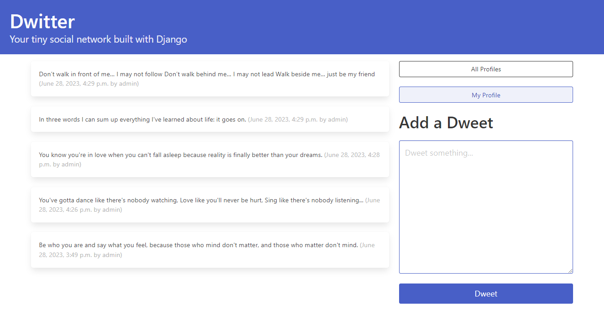

# Django Social Network Application

A social networking application built using the Django framework 
for the back-end and the Bulma framework for the front-end.
Users are able to:
- create users and associated profiles
- follow and unfollow other users
- see who their followers are
- see which other users exist in order to decide who to
follow
- create content 'dweets' for their connections to view (limited to 14o characters)

## Technologies Used

- Python
- Django
- CSS 
- Bulma
